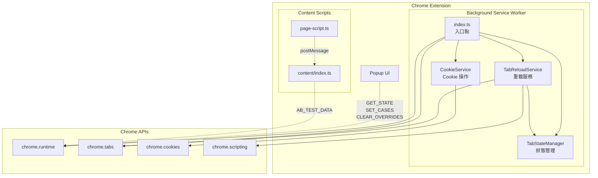
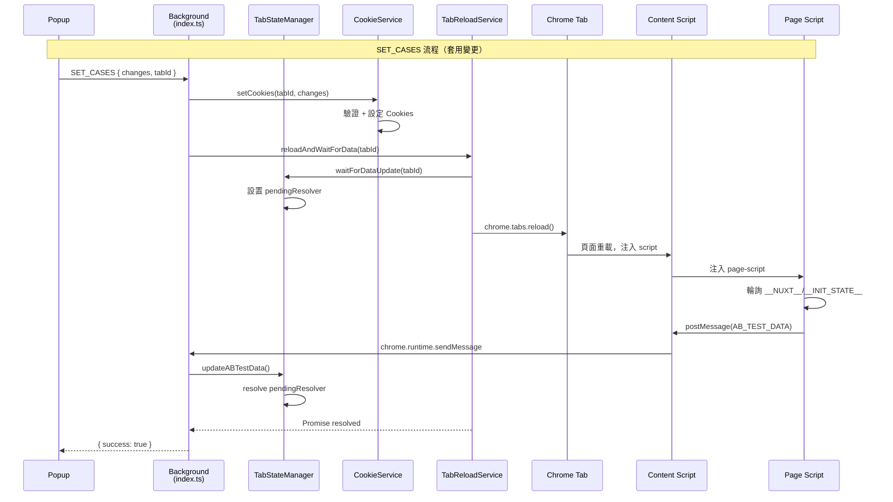
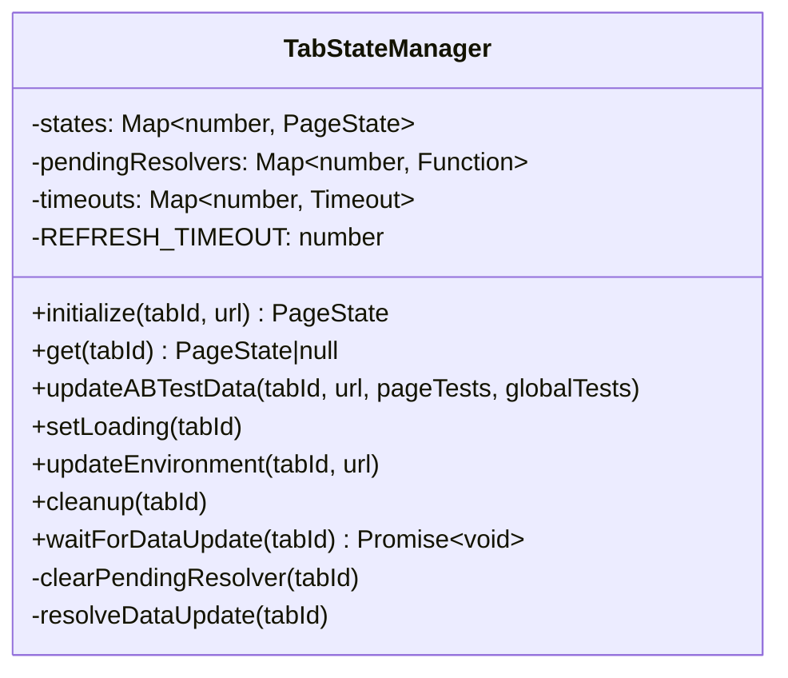
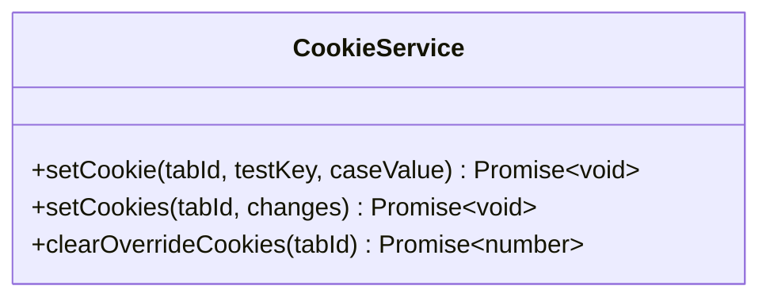
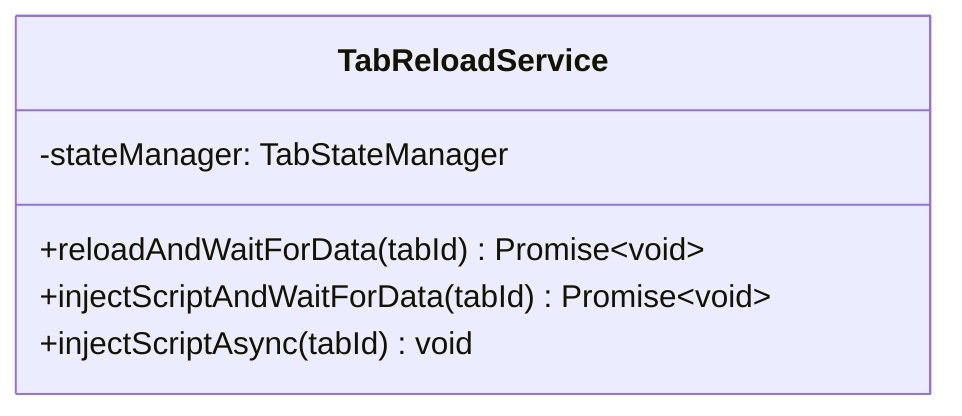
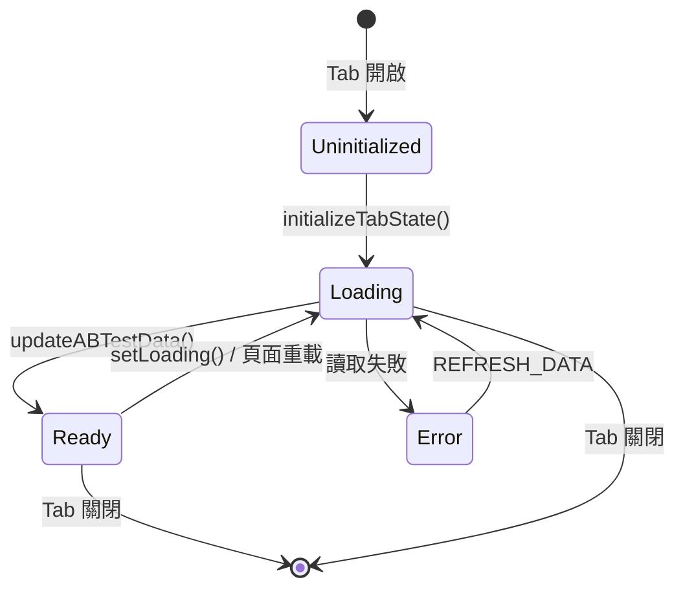

# Background Service Worker 架構文檔

## 目錄結構

```
src/background/
├── index.ts              # 入口點，消息路由和生命週期監聽
├── TabStateManager.ts    # Tab 狀態管理
├── CookieService.ts      # Cookie 操作服務
├── TabReloadService.ts   # Tab 重載服務
└── README.md             # 本文檔
```

## 模組關係圖



## 消息流程圖



## 類別職責

### TabStateManager



**職責**：
- 管理所有 Tab 的 PageState
- 處理異步等待機制（等待 AB_TEST_DATA 回報）
- 提供狀態的 CRUD 操作

### CookieService



**職責**：
- 設定單一 A/B Test override cookie
- 批量設定多個 cookies
- 清除所有 override cookies

### TabReloadService



**職責**：
- 重載頁面並等待數據回報
- 注入 content script 並等待數據
- 處理 Tab 生命週期的 script 注入

## 消息類型

| 類型 | 來源 | 處理方式 | 說明 |
|-----|------|---------|------|
| `AB_TEST_DATA` | Content Script | `tabStateManager.updateABTestData()` | 頁面回報 A/B 測試數據 |
| `GET_STATE` | Popup | `tabStateManager.get()` | 取得當前 Tab 狀態 |
| `SET_CASES` | Popup | `cookieService` + `tabReloadService` | 批量設定多個測試 |
| `REFRESH_DATA` | Popup | `tabReloadService.injectScriptAndWaitForData()` | 重新讀取頁面數據 |
| `CLEAR_OVERRIDES` | Popup | `cookieService` + `tabReloadService` | 清除所有 override |

## 狀態流轉



## 設計決策

### 為什麼使用單例模式？

```typescript
// TabStateManager.ts
export const tabStateManager = new TabStateManager();

// CookieService.ts
export const cookieService = new CookieService();
```

- Service Worker 是單一進程，不需要多實例
- 狀態需要跨消息處理共享
- 簡化依賴注入

### 為什麼 TabReloadService 需要依賴注入？

```typescript
// index.ts
const tabReloadService = new TabReloadService(tabStateManager);
```

- `TabReloadService` 需要調用 `tabStateManager.waitForDataUpdate()`
- 保持單向依賴，避免循環引用
- 便於未來單元測試時 mock

### 為什麼在 reload 前設置等待機制？

```typescript
// TabReloadService.ts
async reloadAndWaitForData(tabId: number): Promise<void> {
  const waitPromise = this.stateManager.waitForDataUpdate(tabId); // 先設置
  await chrome.tabs.reload(tabId);                                 // 再 reload
  await waitPromise;                                               // 最後等待
}
```

- 避免競態條件：如果先 reload 再設置，可能錯過 AB_TEST_DATA 消息
- Promise 在創建時就開始「監聽」，不會錯過任何事件
